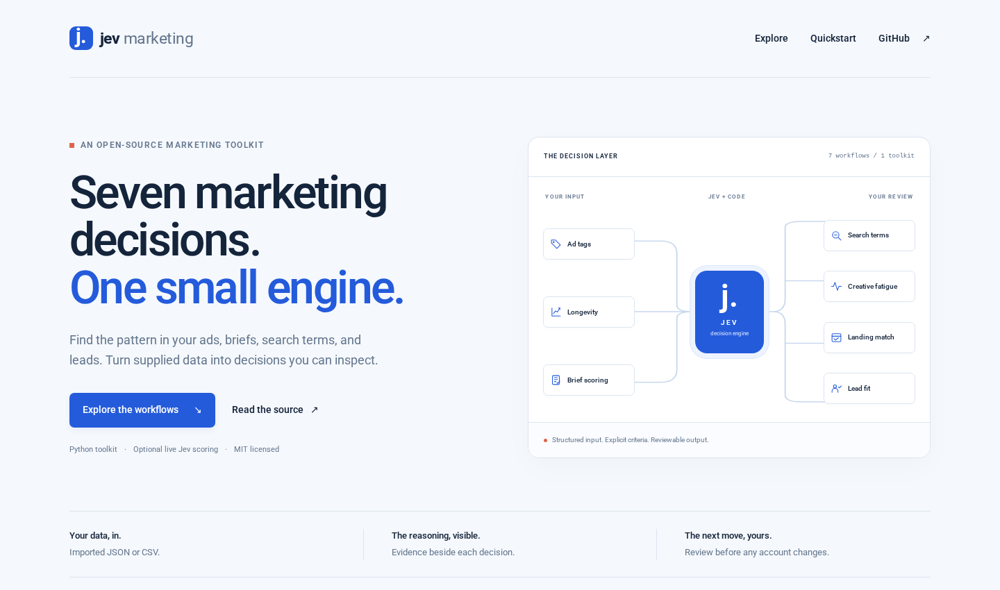

# Jev Marketing

**Seven marketing decisions. One small engine.**

An open-source Python toolkit for inspecting ads, scoring briefs, reviewing search terms, detecting fatigue signals, comparing landing-page promises, and assessing business lead fit. Deterministic calculations handle counts and dates. Optional [Jev](https://typesafe.ai) calls handle structured classification and scoring.

[Explore the interactive demo](https://stas4000.github.io/jev-marketing/) · [Read the source](https://github.com/stas4000/jev-marketing) · [MIT license](LICENSE)

[](https://stas4000.github.io/jev-marketing/)

The browser presentation uses **synthetic examples and frozen, deterministic engine output**. It does not call a model. There are no benchmark or return-on-investment claims.

## Seven workflows

| Workflow | What it does | What to review |
| --- | --- | --- |
| `ad_tags` | Tags supplied ad records by hook, creative format, and offer; calculates observed days running. | Tags describe the imported sample, not the entire ad library. |
| `survival` | Groups observed 60-day longevity by format with eligible denominators and censored records. | Descriptive sample counts, not survival probabilities or profitability. |
| `briefs` | Scores the hook, brand fit, and readiness of a supplied creative brief. | Scores do not predict ad performance. Low confidence routes to review. |
| `search_terms` | Classifies supplied search terms and exports negative keyword candidates. | Review conversions and match types before changing an account. |
| `fatigue` | Compares frequency and CTR across two sufficiently sized observation windows. | A fatigue signal is an observation, not causal proof. |
| `landing_match` | Scores supplied ad promises against supplied landing-page text. | No crawling, usability audit, factual verification, or conversion prediction. |
| `leads` | Scores submitted business facts from 0 to 100 against an explicit ideal-customer profile. | Business fit only, with no sensitive demographic criteria. |

## Quickstart

Python 3.11 or newer recommended. The runtime uses the Python standard library, with no third-party runtime dependencies.

```bash
git clone https://github.com/stas4000/jev-marketing.git
cd jev-marketing
python3 -m venv .venv
source .venv/bin/activate
python -m pip install -e .
python -m jev_marketing demo
```

On Windows, activate with `.venv\Scripts\activate` instead. No API key or network call is needed for the demo. The installed `jev-marketing` command exposes the same interface.

Run one workflow and save its output:

```bash
python -m jev_marketing list
python -m jev_marketing run ad_tags \
  --input examples/ad_tags.json --mode demo --output ad-tags.json
```

Review a CSV search-term export with a separate context file:

```bash
python -m jev_marketing run search_terms \
  --input examples/search_terms.csv \
  --context examples/search_terms_context.json \
  --mode demo --output search-review.json
```

CSV import is supported for `search_terms`; other workflows use JSON. The tool produces JSON, including candidates and their evidence, without writing to an ad account.

## Input schema

Each JSON input is an object containing `records` plus the context required by its workflow. Start from the complete, runnable files in [`examples/`](examples/).

| Context | Fields |
| --- | --- |
| Observation date | `as_of`, an ISO `YYYY-MM-DD` date |
| Brand | `brand`: `name`, `description`, `keywords` |
| Ideal customer | `icp`: `industry`, `company_size`, `need`, `budget`, `timeline` |

| Workflow | Record fields |
| --- | --- |
| `ad_tags` | `id`, `text`, `creative_format`, `start_date`, `active`; `end_date` for ended ads |
| `survival` | `id`, `format`, `start_date`, `active`; `end_date` for ended ads |
| `briefs` | `id`, `hook`, `body`, `cta` |
| `search_terms` | `id`, `query`, `impressions`, `clicks`, `cost`, `conversions` |
| `fatigue` | `id`, `prior`, `current`; each window contains `start_date`, `end_date`, `impressions`, `clicks`, `reach` |
| `landing_match` | `id`, `ad_text`, `landing_text` |
| `leads` | `id`, `business_facts`: `company`, `industry`, `company_size`, `need`, `budget`, `timeline`, `role` |

Dates, numeric values, record IDs, and workflow-specific constraints are validated before analysis. Fatigue windows must have equal duration and must not overlap. Input and output records retain source IDs so results can be traced to the supplied data.

## Live Jev

Live calls are opt-in. Store credentials in environment variables, never input files or command-line flags. Set `TYPESAFE_API_KEY` securely in your environment for the default direct provider, or `OPENROUTER_API_KEY` for OpenRouter.

```bash
# Uses TYPESAFE_API_KEY from your environment.
python -m jev_marketing run briefs \
  --input examples/briefs.json --mode live \
  --provider typesafe --output live-briefs.json

# Uses OPENROUTER_API_KEY from your environment.
python -m jev_marketing run leads \
  --input examples/leads.json --mode live \
  --provider openrouter --output live-leads.json
```

| Provider | Endpoint | Model | Environment variable |
| --- | --- | --- | --- |
| TypeSafe | `https://api.typesafe.ai/v1/systemone` | `jev-latest` | `TYPESAFE_API_KEY` |
| OpenRouter | `https://openrouter.ai/api/alpha/decisions` | `~typesafe/jev-latest` | `OPENROUTER_API_KEY` |

The five language workflows use typed `choice` or `score` questions. `survival` and `fatigue` are calculations and do not need a model, including in live mode. The default review threshold is `0.7`; override with `--confidence-threshold` when you have validation evidence for your use case.

Jev scores use an explicit three-level rubric: weak, partial, or strong support. The result maps these levels to a 0–100 presentation. This is a rubric score, not a precise business probability. The deterministic demo uses illustrative confidence `0.5`, which routes its model-based examples to review under the default threshold. Demo probabilities are fixtures, not calibrated uncertainty.

Live mode sends supplied context and records to the configured provider. Minimize personal data and use only data you are authorized to process. Provider failures are surfaced without automatic retries; output files are replaced only after a complete successful run. Usage fields reflect provider data where available; unavailable billing and token values remain unknown.

Official references: [API contract](https://docs.typesafe.ai/api.md), [choice primitive](https://docs.typesafe.ai/primitives/choice.md), [score primitive](https://docs.typesafe.ai/primitives/score.md), [models](https://docs.typesafe.ai/models.md). Provider availability and model aliases may change.

## Output and evidence

Every result includes `schema_version`, `workflow`, `mode`, `method`, `limits`, `usage`, and `rows`, with a summary where relevant. Each row retains its source ID, decision, confidence where applicable, and supporting evidence. The schema also carries workflow-specific tags, scores, counts, or candidate fields.

The presentation's [`docs/data.json`](docs/data.json) is generated by the engine, not manually written:

```bash
python -m jev_marketing demo --output docs/data.json
python -m http.server 8080 --directory docs
```

Open `http://localhost:8080`. The no-build site works from GitHub Pages under a repository subpath. Readers can select all seven examples, inspect input and output, and download the selected JSON. It has no account connection or analytics. The page loads Roboto from Google Fonts, with a local system-font fallback.

## Measured live check

On 20 September 2026, a separate live check sent nine synthetic records through four workflows on OpenRouter. The provider reported **$0.00021126** for nine calls. Sequential wall time was **4.767 seconds**, including CLI startup. The resolved model was `typesafe/jev-1.13-20260917`.

A buyer query was kept, while job-seeking and educational queries became negative candidates. Matched and mismatched landing examples scored 99 and 0; matching and poor-fit business leads scored 99 and 0. Both creative briefs were retained for review because their confidence was low. These are observed synthetic-case outputs, not evidence of production accuracy, calibrated confidence, or typical latency and cost.

See the [sanitized live check results](docs/live-verification.json). The interactive browser workbench continues to show deterministic demo results, not this live run.

## MCP

The same workflows are available through a newline-delimited MCP stdio server:

```bash
python -m jev_marketing mcp
```

Configure an MCP client to launch that command from this checkout or its installed environment. Use the client's tool discovery to inspect the seven workflow schemas. Credentials for live calls must be supplied through the server process environment. MCP tools share the CLI validation and decision engine.

## Tests

All external provider calls in the test suite are mocked:

```bash
python -m unittest discover -s tests -v
python -m jev_marketing demo --output /tmp/jev-marketing-demo.json
```

See [CONTRIBUTING.md](CONTRIBUTING.md) for fixture regeneration and browser checks.

## Limitations

- This is an imported-data toolkit. It does not scrape Meta's ad library, connect to an ad account, apply negatives, upload conversions, or change budgets.
- An ad observed running for 60 days may be unprofitable. The longevity summary describes the supplied sample and its observation window; it does not model survival or generalize to all ads.
- Keyword heuristics in demo mode are intentionally limited. They exist for reproducibility and interface inspection, not production-quality language understanding.
- Live results depend on the model, supplied evidence, rubric, and thresholds. A confident result can still be wrong. Validate on your own held-out examples.
- Fatigue thresholds are a transparent heuristic. Inadequate data must remain insufficient; CTR movement does not identify its cause.
- Lead scoring uses an explicit business profile and rejects supported sensitive-field inputs. Free text still needs review: do not submit sensitive personal facts or proxy criteria.
- A landing-page alignment score is not factual, legal, accessibility, or conversion assurance.
- No speed, cost, accuracy, or return-on-investment guarantees are made.

## Provenance

Inspired by [this seven-workflow marketing post](https://x.com/korzhov_dm/status/2101438112693948495). This repository is an independent implementation by [Stas Sorokin](https://github.com/stas4000), not an official TypeSafe product. All bundled company, ad, search-term, brief, and lead examples are synthetic. The original post is inspiration, not experimental evidence for this toolkit.

MIT licensed. See [LICENSE](LICENSE).
